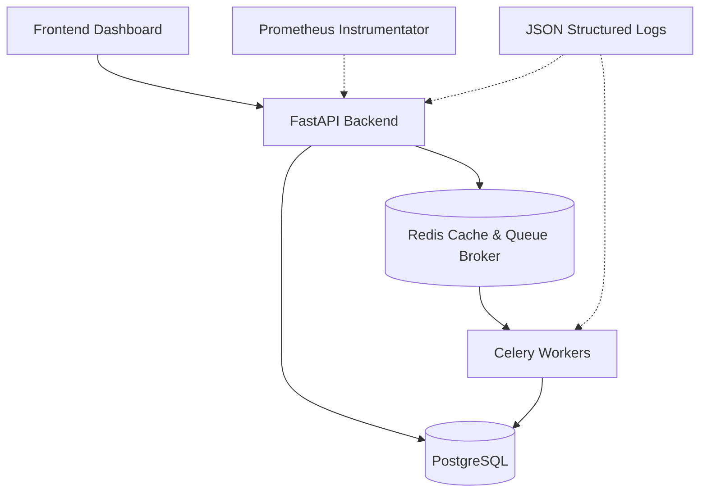

# Architecture Overview

## Layers
* **Presentation**: React (Vite, Tailwind).
* **API**: FastAPI orchestrating requests and authentication.
* **Business Logic**: Core services isolated from infrastructure.
* **Background Execution**: JobQueue abstraction utilizing Celery for execution and Redis as message broker.
* **ML Processing**: Fairlearn, SHAP, and AI abstractions isolated in `services/ml_engine`.
* **Infrastructure**: PostgreSQL, Redis, structured logging.
