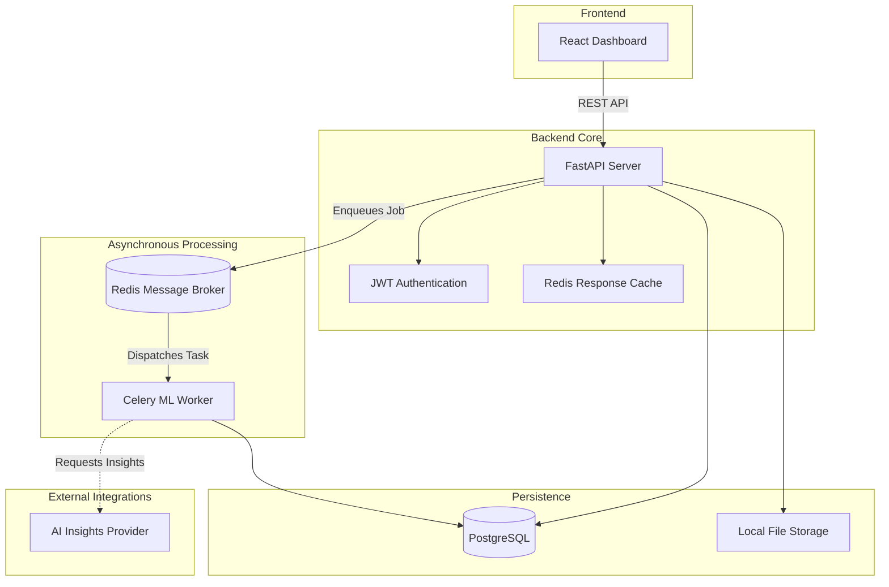

# FairLens AI


FairLens AI is a production-ready artificial intelligence platform designed to detect, analyze, and mitigate bias in machine learning datasets and models. It provides a comprehensive suite of fairness metrics, explainability insights using SHAP, and actionable recommendations powered by Large Language Models (LLMs).

## Architecture Overview



## Key Features

- **Automated Fairness Analysis**: Calculate Disparate Impact, Demographic Parity, and Equal Opportunity across any protected attributes using the Fairlearn engine.
- **Model Explainability**: Understand localized and global feature importance through natively integrated SHAP analysis.
- **LLM-Powered Insights**: Generate human-readable summaries and mitigation strategies utilizing OpenAI, Google Gemini, or local Stub providers.
- **Asynchronous Execution**: Heavy machine learning computations are offloaded to highly scalable Celery workers, ensuring the API remains highly responsive.
- **Production-Ready Observability**: Built-in structured JSON logging (structlog), correlation IDs, and Prometheus metrics for seamless enterprise monitoring.
- **Hardened Security**: Argon2id password hashing, strict JWT token validation, and comprehensive Cross-Origin Resource Sharing (CORS) enforcement.

## Technology Stack

- **Frontend**: React, Tailwind CSS, Recharts
- **Backend**: Python 3.12, FastAPI, SQLAlchemy, Alembic, Celery, Redis
- **Machine Learning**: Scikit-Learn, Fairlearn, SHAP, Pandas
- **Infrastructure**: Docker, Docker Compose, PostgreSQL

## Getting Started

### Prerequisites

Ensure you have the following installed on your system:
- Docker and Docker Compose
- Git

### Installation

1. **Clone the repository:**
   ```bash
   git clone https://github.com/Zish19/Fairlens-AI.git
   cd Fairlens-AI
   ```

2. **Configure the environment:**
   Create a `.env` file by copying the provided example.
   ```bash
   cp .env.example .env
   ```
   *Note: Modify the `AI_PROVIDER` and corresponding API keys if you wish to use OpenAI or Gemini instead of the local stub.*

3. **Start the infrastructure:**
   Use Docker Compose to build and start the entire stack, including PostgreSQL, Redis, FastAPI, Celery, and the React frontend.
   ```bash
   docker compose build
   docker compose up -d
   ```

4. **Access the application:**
   - **Frontend UI**: `http://localhost:5173`
   - **API Documentation (Swagger)**: `http://localhost:8000/docs`
   - **Metrics Endpoint**: `http://localhost:8000/metrics`

## Project Structure

```text
Fairlens-AI/
├── apps/
│   ├── api/
│   │   ├── core/           # Configuration, database setup, caching, security
│   │   ├── models/         # SQLAlchemy ORM definitions
│   │   ├── routers/        # FastAPI endpoint controllers
│   │   ├── schemas/        # Pydantic validation models
│   │   ├── services/       # Business logic and validators
│   │   ├── tasks/          # Celery background jobs
│   │   └── tests/          # Pytest integration and unit tests
│   └── web/                # React frontend application
├── services/
│   └── ml_engine/          # Fairlearn and SHAP computational logic
├── docker/                 # Production-ready Dockerfiles
├── alembic/                # Database migration scripts
└── docker-compose.yml      # Infrastructure orchestration
```

## Development and Testing

The backend test suite uses `pytest` and ensures complete isolation using an in-memory or dynamically spun-up test database.

To run the test suite locally:
```bash
# Export the PYTHONPATH to ensure module resolution
export PYTHONPATH=.
pytest apps/api/
```

## Continuous Integration

The repository features a rigorous GitHub Actions CI pipeline that enforces:
- Proper dependency installation
- Python test suite validation
- Alembic database migration fidelity checks
- Full Docker Compose infrastructure smoke testing

## License

This project is licensed under the MIT License.
